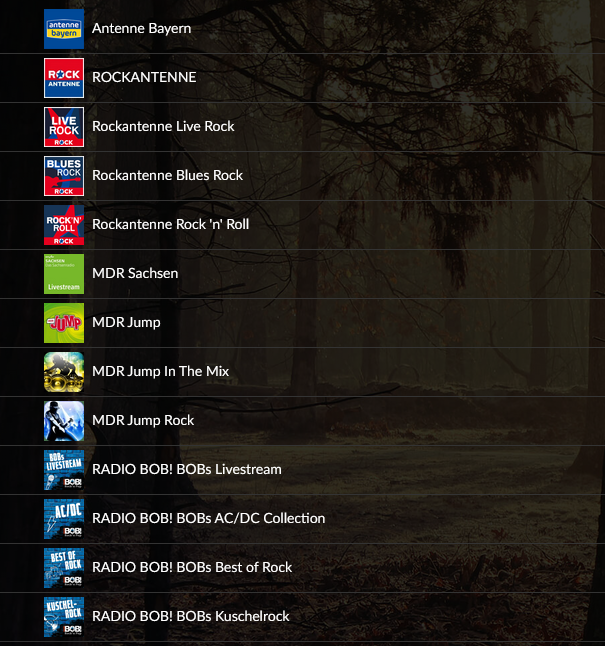

# Volumio Audioplayer

Volumio is a Audioplayer which runs on a Raspberry Pi and other small Computers. To control the Player, it provides a Webinterface.

Compatibility: I am running it on the very slow Raspberry Pi Zero and I DONT have any problems with the audio playback. Since it doesnt have a Audio output, I connected a USB-Soundcard to the Pi, which was recognized by the software without any problems. 

# Installation
The Installation is very simple. 
Download the Volumio-Image form https://volumio.org/get-started/.

The Installation process is well described in the [Quick Start Guide](https://cdn.volumio.org/wp-content/uploads/2019/01/Quick-Start-Guide-Volumio.pdf).

# Create Your own Playlists for Webradio-Stations
Volumio does have an internet radio function but I like to have one playlist with all my radio stations at one point. If you have multiple Volumio instances you can simply copy this playlist file to every instance instead of favoring every single station of every single instance.



## HOW TO

1. Search for the Stream-URL. Most Radio Stations post them on their website.
2. Search for a Thumbnail-URL. I recommend to use Pictures from https://tunein.com/ because they are easy to find and downloadable. Just search for the Radiostation and right-click onto the Thumbnail->"Open in new Tab" and then copy the Browser-URL of the Picture.
3. Paste these URLs into a Playlist file:
   
   File scheme:
   ```
   [
    {"service":"webradio","uri":"---STREAM-URL---","title":"---NAME OF THE STATION---","albumart":"---LINK TO THUMBNAIL---"},
    {"service":"webradio","uri":"---STREAM-URL---","title":"---NAME OF THE STATION---","albumart":"---LINK TO THUMBNAIL---"},
    
    .......

    {"service":"webradio","uri":"---STREAM-URL---","title":"---NAME OF THE STATION---","albumart":"---LINK TO THUMBNAIL---"},
    {"service":"webradio","uri":"---STREAM-URL---","title":"---NAME OF THE STATION---","albumart":"---LINK TO THUMBNAIL---"}
   ]
   ```
   - **!!! NO "`,`" AFTER THE LAST STATION IN THE LIST !!!** 
   - Name the File as you want, **no file extension !!**.
   - **Use my [Sample Playlist](Sample_Playlist) as a reference.**

<br>

4. Copy the Playlist File to the Volumio-Device (for Example a Rasperry Pi) via SSH

   - Go to: [http://VOLUMIO_DEVICE_IP/dev/](http://VOLUMIO_DEVICE_IP/dev/)  and click on **SSH - Enable**
   - USE a SFTP-Client (like WinSCP) to copy the Files:
       - SSH-Username: `volumio`
       - SSH-Password: `volumio`
       - File Path for the Playlist File: `/data/playlist/`

   - Go to: [http://VOLUMIO_DEVICE_IP/dev/](http://VOLUMIO_DEVICE_IP/dev/)  and click on **SSH - Disable**

5. Enjoy!

